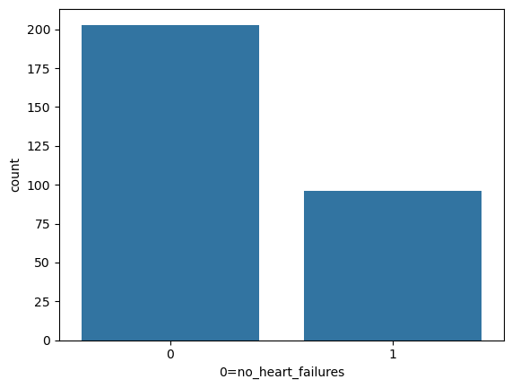

```python
# Importing libraries
import pandas as pd
import numpy as np
import matplotlib.pyplot as plt
import seaborn as sns
from sklearn.model_selection import train_test_split
from sklearn.preprocessing import StandardScaler
from sklearn.svm import SVC
from sklearn.metrics import accuracy_score, confusion_matrix, classification_report

df=pd.read_csv('C:\\Users\\welcome\\Documents\\heart_failure_clinical_records_dataset.csv')
df

```


<div>
<style scoped>
    .dataframe tbody tr th:only-of-type {
        vertical-align: middle;
    }

    .dataframe tbody tr th {
        vertical-align: top;
    }

    .dataframe thead th {
        text-align: right;
    }
</style>
<table border="1" class="dataframe">
  <thead>
    <tr style="text-align: right;">
      <th></th>
      <th>age</th>
      <th>anaemia</th>
      <th>creatinine_phosphokinase</th>
      <th>diabetes</th>
      <th>ejection_fraction</th>
      <th>high_blood_pressure</th>
      <th>platelets</th>
      <th>serum_creatinine</th>
      <th>serum_sodium</th>
      <th>sex</th>
      <th>smoking</th>
      <th>time</th>
      <th>DEATH_EVENT</th>
    </tr>
  </thead>
  <tbody>
    <tr>
      <th>0</th>
      <td>75.0</td>
      <td>0</td>
      <td>582</td>
      <td>0</td>
      <td>20</td>
      <td>1</td>
      <td>265000.00</td>
      <td>1.9</td>
      <td>130</td>
      <td>1</td>
      <td>0</td>
      <td>4</td>
      <td>1</td>
    </tr>
    <tr>
      <th>1</th>
      <td>55.0</td>
      <td>0</td>
      <td>7861</td>
      <td>0</td>
      <td>38</td>
      <td>0</td>
      <td>263358.03</td>
      <td>1.1</td>
      <td>136</td>
      <td>1</td>
      <td>0</td>
      <td>6</td>
      <td>1</td>
    </tr>
    <tr>
      <th>2</th>
      <td>65.0</td>
      <td>0</td>
      <td>146</td>
      <td>0</td>
      <td>20</td>
      <td>0</td>
      <td>162000.00</td>
      <td>1.3</td>
      <td>129</td>
      <td>1</td>
      <td>1</td>
      <td>7</td>
      <td>1</td>
    </tr>
    <tr>
      <th>3</th>
      <td>50.0</td>
      <td>1</td>
      <td>111</td>
      <td>0</td>
      <td>20</td>
      <td>0</td>
      <td>210000.00</td>
      <td>1.9</td>
      <td>137</td>
      <td>1</td>
      <td>0</td>
      <td>7</td>
      <td>1</td>
    </tr>
    <tr>
      <th>4</th>
      <td>65.0</td>
      <td>1</td>
      <td>160</td>
      <td>1</td>
      <td>20</td>
      <td>0</td>
      <td>327000.00</td>
      <td>2.7</td>
      <td>116</td>
      <td>0</td>
      <td>0</td>
      <td>8</td>
      <td>1</td>
    </tr>
    <tr>
      <th>...</th>
      <td>...</td>
      <td>...</td>
      <td>...</td>
      <td>...</td>
      <td>...</td>
      <td>...</td>
      <td>...</td>
      <td>...</td>
      <td>...</td>
      <td>...</td>
      <td>...</td>
      <td>...</td>
      <td>...</td>
    </tr>
    <tr>
      <th>294</th>
      <td>62.0</td>
      <td>0</td>
      <td>61</td>
      <td>1</td>
      <td>38</td>
      <td>1</td>
      <td>155000.00</td>
      <td>1.1</td>
      <td>143</td>
      <td>1</td>
      <td>1</td>
      <td>270</td>
      <td>0</td>
    </tr>
    <tr>
      <th>295</th>
      <td>55.0</td>
      <td>0</td>
      <td>1820</td>
      <td>0</td>
      <td>38</td>
      <td>0</td>
      <td>270000.00</td>
      <td>1.2</td>
      <td>139</td>
      <td>0</td>
      <td>0</td>
      <td>271</td>
      <td>0</td>
    </tr>
    <tr>
      <th>296</th>
      <td>45.0</td>
      <td>0</td>
      <td>2060</td>
      <td>1</td>
      <td>60</td>
      <td>0</td>
      <td>742000.00</td>
      <td>0.8</td>
      <td>138</td>
      <td>0</td>
      <td>0</td>
      <td>278</td>
      <td>0</td>
    </tr>
    <tr>
      <th>297</th>
      <td>45.0</td>
      <td>0</td>
      <td>2413</td>
      <td>0</td>
      <td>38</td>
      <td>0</td>
      <td>140000.00</td>
      <td>1.4</td>
      <td>140</td>
      <td>1</td>
      <td>1</td>
      <td>280</td>
      <td>0</td>
    </tr>
    <tr>
      <th>298</th>
      <td>50.0</td>
      <td>0</td>
      <td>196</td>
      <td>0</td>
      <td>45</td>
      <td>0</td>
      <td>395000.00</td>
      <td>1.6</td>
      <td>136</td>
      <td>1</td>
      <td>1</td>
      <td>285</td>
      <td>0</td>
    </tr>
  </tbody>
</table>
<p>299 rows × 13 columns</p>
</div>


```python
df.head()#show first 5rows
```


<div>
<style scoped>
    .dataframe tbody tr th:only-of-type {
        vertical-align: middle;
    }

    .dataframe tbody tr th {
        vertical-align: top;
    }

    .dataframe thead th {
        text-align: right;
    }
</style>
<table border="1" class="dataframe">
  <thead>
    <tr style="text-align: right;">
      <th></th>
      <th>age</th>
      <th>anaemia</th>
      <th>creatinine_phosphokinase</th>
      <th>diabetes</th>
      <th>ejection_fraction</th>
      <th>high_blood_pressure</th>
      <th>platelets</th>
      <th>serum_creatinine</th>
      <th>serum_sodium</th>
      <th>sex</th>
      <th>smoking</th>
      <th>time</th>
      <th>DEATH_EVENT</th>
    </tr>
  </thead>
  <tbody>
    <tr>
      <th>0</th>
      <td>75.0</td>
      <td>0</td>
      <td>582</td>
      <td>0</td>
      <td>20</td>
      <td>1</td>
      <td>265000.00</td>
      <td>1.9</td>
      <td>130</td>
      <td>1</td>
      <td>0</td>
      <td>4</td>
      <td>1</td>
    </tr>
    <tr>
      <th>1</th>
      <td>55.0</td>
      <td>0</td>
      <td>7861</td>
      <td>0</td>
      <td>38</td>
      <td>0</td>
      <td>263358.03</td>
      <td>1.1</td>
      <td>136</td>
      <td>1</td>
      <td>0</td>
      <td>6</td>
      <td>1</td>
    </tr>
    <tr>
      <th>2</th>
      <td>65.0</td>
      <td>0</td>
      <td>146</td>
      <td>0</td>
      <td>20</td>
      <td>0</td>
      <td>162000.00</td>
      <td>1.3</td>
      <td>129</td>
      <td>1</td>
      <td>1</td>
      <td>7</td>
      <td>1</td>
    </tr>
    <tr>
      <th>3</th>
      <td>50.0</td>
      <td>1</td>
      <td>111</td>
      <td>0</td>
      <td>20</td>
      <td>0</td>
      <td>210000.00</td>
      <td>1.9</td>
      <td>137</td>
      <td>1</td>
      <td>0</td>
      <td>7</td>
      <td>1</td>
    </tr>
    <tr>
      <th>4</th>
      <td>65.0</td>
      <td>1</td>
      <td>160</td>
      <td>1</td>
      <td>20</td>
      <td>0</td>
      <td>327000.00</td>
      <td>2.7</td>
      <td>116</td>
      <td>0</td>
      <td>0</td>
      <td>8</td>
      <td>1</td>
    </tr>
  </tbody>
</table>
</div>


```python
df.info()#its shows the information on those columns
```

    <class 'pandas.core.frame.DataFrame'>
    RangeIndex: 299 entries, 0 to 298
    Data columns (total 13 columns):
     #   Column                    Non-Null Count  Dtype  
    ---  ------                    --------------  -----  
     0   age                       299 non-null    float64
     1   anaemia                   299 non-null    int64  
     2   creatinine_phosphokinase  299 non-null    int64  
     3   diabetes                  299 non-null    int64  
     4   ejection_fraction         299 non-null    int64  
     5   high_blood_pressure       299 non-null    int64  
     6   platelets                 299 non-null    float64
     7   serum_creatinine          299 non-null    float64
     8   serum_sodium              299 non-null    int64  
     9   sex                       299 non-null    int64  
     10  smoking                   299 non-null    int64  
     11  time                      299 non-null    int64  
     12  DEATH_EVENT               299 non-null    int64  
    dtypes: float64(3), int64(10)
    memory usage: 30.5 KB
    


```python
df.describe() #its show descrition like summary 
```


<div>
<style scoped>
    .dataframe tbody tr th:only-of-type {
        vertical-align: middle;
    }

    .dataframe tbody tr th {
        vertical-align: top;
    }

    .dataframe thead th {
        text-align: right;
    }
</style>
<table border="1" class="dataframe">
  <thead>
    <tr style="text-align: right;">
      <th></th>
      <th>age</th>
      <th>anaemia</th>
      <th>creatinine_phosphokinase</th>
      <th>diabetes</th>
      <th>ejection_fraction</th>
      <th>high_blood_pressure</th>
      <th>platelets</th>
      <th>serum_creatinine</th>
      <th>serum_sodium</th>
      <th>sex</th>
      <th>smoking</th>
      <th>time</th>
      <th>DEATH_EVENT</th>
    </tr>
  </thead>
  <tbody>
    <tr>
      <th>count</th>
      <td>299.000000</td>
      <td>299.000000</td>
      <td>299.000000</td>
      <td>299.000000</td>
      <td>299.000000</td>
      <td>299.000000</td>
      <td>299.000000</td>
      <td>299.00000</td>
      <td>299.000000</td>
      <td>299.000000</td>
      <td>299.00000</td>
      <td>299.000000</td>
      <td>299.00000</td>
    </tr>
    <tr>
      <th>mean</th>
      <td>60.833893</td>
      <td>0.431438</td>
      <td>581.839465</td>
      <td>0.418060</td>
      <td>38.083612</td>
      <td>0.351171</td>
      <td>263358.029264</td>
      <td>1.39388</td>
      <td>136.625418</td>
      <td>0.648829</td>
      <td>0.32107</td>
      <td>130.260870</td>
      <td>0.32107</td>
    </tr>
    <tr>
      <th>std</th>
      <td>11.894809</td>
      <td>0.496107</td>
      <td>970.287881</td>
      <td>0.494067</td>
      <td>11.834841</td>
      <td>0.478136</td>
      <td>97804.236869</td>
      <td>1.03451</td>
      <td>4.412477</td>
      <td>0.478136</td>
      <td>0.46767</td>
      <td>77.614208</td>
      <td>0.46767</td>
    </tr>
    <tr>
      <th>min</th>
      <td>40.000000</td>
      <td>0.000000</td>
      <td>23.000000</td>
      <td>0.000000</td>
      <td>14.000000</td>
      <td>0.000000</td>
      <td>25100.000000</td>
      <td>0.50000</td>
      <td>113.000000</td>
      <td>0.000000</td>
      <td>0.00000</td>
      <td>4.000000</td>
      <td>0.00000</td>
    </tr>
    <tr>
      <th>25%</th>
      <td>51.000000</td>
      <td>0.000000</td>
      <td>116.500000</td>
      <td>0.000000</td>
      <td>30.000000</td>
      <td>0.000000</td>
      <td>212500.000000</td>
      <td>0.90000</td>
      <td>134.000000</td>
      <td>0.000000</td>
      <td>0.00000</td>
      <td>73.000000</td>
      <td>0.00000</td>
    </tr>
    <tr>
      <th>50%</th>
      <td>60.000000</td>
      <td>0.000000</td>
      <td>250.000000</td>
      <td>0.000000</td>
      <td>38.000000</td>
      <td>0.000000</td>
      <td>262000.000000</td>
      <td>1.10000</td>
      <td>137.000000</td>
      <td>1.000000</td>
      <td>0.00000</td>
      <td>115.000000</td>
      <td>0.00000</td>
    </tr>
    <tr>
      <th>75%</th>
      <td>70.000000</td>
      <td>1.000000</td>
      <td>582.000000</td>
      <td>1.000000</td>
      <td>45.000000</td>
      <td>1.000000</td>
      <td>303500.000000</td>
      <td>1.40000</td>
      <td>140.000000</td>
      <td>1.000000</td>
      <td>1.00000</td>
      <td>203.000000</td>
      <td>1.00000</td>
    </tr>
    <tr>
      <th>max</th>
      <td>95.000000</td>
      <td>1.000000</td>
      <td>7861.000000</td>
      <td>1.000000</td>
      <td>80.000000</td>
      <td>1.000000</td>
      <td>850000.000000</td>
      <td>9.40000</td>
      <td>148.000000</td>
      <td>1.000000</td>
      <td>1.00000</td>
      <td>285.000000</td>
      <td>1.00000</td>
    </tr>
  </tbody>
</table>
</div>


```python
df.columns
```


    Index(['age', 'anaemia', 'creatinine_phosphokinase', 'diabetes',
           'ejection_fraction', 'high_blood_pressure', 'platelets',
           'serum_creatinine', 'serum_sodium', 'sex', 'smoking', 'time',
           'DEATH_EVENT'],
          dtype='object')


```python
sn=['anaemia','diabetes','sex','smoking','DEATH_EVENT'] #using list for no of column to take directly
for my in sn: #using for loop to excute one by one 
    df[my]=df[my].astype("category")

```


```python
df.info()
```

    <class 'pandas.core.frame.DataFrame'>
    RangeIndex: 299 entries, 0 to 298
    Data columns (total 13 columns):
     #   Column                    Non-Null Count  Dtype  
    ---  ------                    --------------  -----  
     0   age                       299 non-null    float64
     1   anaemia                   299 non-null    int64  
     2   creatinine_phosphokinase  299 non-null    int64  
     3   diabetes                  299 non-null    int64  
     4   ejection_fraction         299 non-null    int64  
     5   high_blood_pressure       299 non-null    int64  
     6   platelets                 299 non-null    float64
     7   serum_creatinine          299 non-null    float64
     8   serum_sodium              299 non-null    int64  
     9   sex                       299 non-null    int64  
     10  smoking                   299 non-null    int64  
     11  time                      299 non-null    int64  
     12  DEATH_EVENT               299 non-null    int64  
    dtypes: float64(3), int64(10)
    memory usage: 30.5 KB
    


```python
sns.countplot(x='DEATH_EVENT',data=df)
plt.xlabel("0=no_heart_failures")
```


    Text(0.5, 0, '0=no_heart_failures')


    

    


```python

```


```python

```


```python

```
